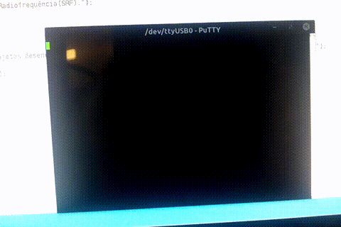

# IMD-SRF

Este repositório é destinado a apresentar experimentos desenvolvidos durante as aulas da disciplina de **Projetos de Sistemas de Radiofrequência** do Instituto Metrópole Digital(IMD).

Durante os projetos desenvolvidos foi possível observar e entender na prática alguns tipos de comunicação usando microcontroladores PIC18F45K20 e ATmega2560 (Arduino Mega 2560). Os experimentos estão descritos em diferentes partes do repositório, que podem ser acessados a partir dos links:

1. [Semana 1 - Arduino Mega e comunicação serial com computador](./src/Semana1/semana1.md)
2. [Semana 2 - Comunicação serial entre Arduino e PIC](./src/Semana2/semana2.md)
3. [Semana 3 - Comunicação serial entre PICs](./src/Semana3/semana3.md)
4. [Semana 4 - Comunicação serial síncrona entre Arduino e PIC](./src/Semana4/semana4.md)

