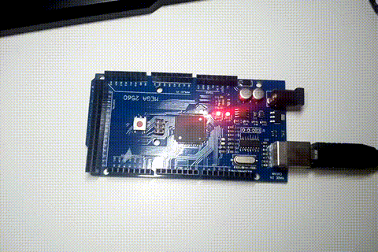

# SEMANA 1

**Microcontrolador:**
- ATmega2560 (Arduino Mega 2560)

**Objetivos:**
- Identificar interface de comunicação serial USART0 (TX0 e RX0); e
- Programar o Arduino Mega para enviar dados via comunicação serial.

**Descrição:**
Os experimentos desta semana consistiam basicamente em programar o Arduino Mega para enviar dados por comunicação serial para o computador por meio da interface USART0, que é ligado ao conector USB da placa. Os dados enviados podem ser exibidos pelo programa [PuTTY](https://www.putty.org/), bastando apenas configurar a comunicação como serial, a velocidade e o USB em que a placa está conectada.

## Experimento 1

O experimento 1 consiste em usar as [funções do Arduino]("https://www.arduino.cc/reference/en/language/functions/communication/serial/") para a comunicação serial com o computador.

## Experimento 2

O experimento 2 consiste em usar registradores do microcontrolador ATmega2560 do Arduino para gerar uma comunicação serial UART de configuração 8N1 com o computador.

