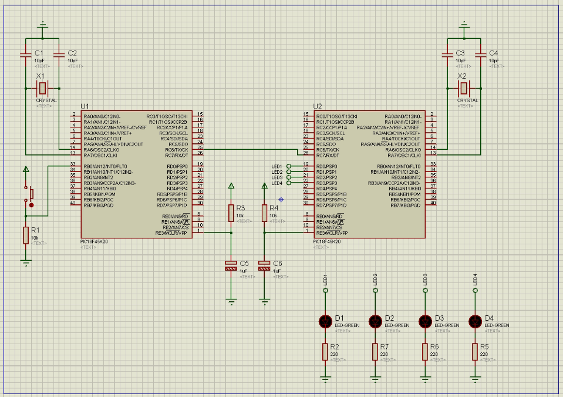

# SEMANA 3



**Microcontroladores:**
- 2 PIC18F45K20.

**Objetivos:**
- Configurar os microcontroladores como transmissor e receptor; e
- Simular a transmissão de dados no [Proteus](https://www.labcenter.com/) ISIS.

**Descrição:**
O experimento desta semana envolve a simulação da comunicação serial USART entre PICs:

- **Transmissão:** 
Um dos PICs será configurado como transmissor(pino RC6, TX) e terá uma entrada que irá identificar o estado da porta RB0 ligado a um circuito de conectado a um botão em configuração [PULL-DOWN](https://www.filipeflop.com/blog/entendendo-o-pull-up-e-pull-down-no-arduino/) e durante o loop( ```while(1){}``` ) irá verificar o estado do RB0. Quando o botão estiver pressionado, o RB0 irá receber HIGH(nível lógico alto) e transmitir um código 10 vezes para o receptor a cada 500 milisegundos.

- **Recepção:**
Um dos PICs será configurado como receptor(pino RC7, RX) e terá quatro saídas nos PORTD para LEDs. Em seu loop o microcontrolador irá verificar se recebeu o valor "combinado" com o transmissor(85 ou 0b01010101). Caso receba o valor correto, ele irá ativar as quatro saídas do PORTD e ligará os LEDs durante 300 milisegundos.

- **Resumo:** 
Toda vez que o botão conectado ao transmissor for pressionado, este irá transmitir um sinal de ativação dos LEDs do receptor a cada 500 milisegundos por 10 vezes. 