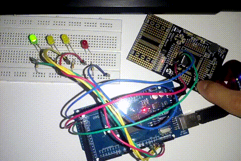

# SEMANA 4

**Microcontroladores:**
- ATmega2560 (Arduino Mega 2560)
- PIC18F45K20

**Objetivos:**
- Programar o Arduino como receptor SPI; e
- Programar o PIC como transmissor(mestre) SPI.

**Descrição:**
O experimento desta semana consistia em desenvolver uma comunicação serial [SPI](https://pt.wikipedia.org/wiki/Serial_Peripheral_Interface) entre o PIC e o Arduino.

- **Transmissão:** 
O PIC irá ser configurado como transmissor(mestre), irá ter uma entrada pino RB0 ligado a um botão em um circuito [PULL-UP](https://www.filipeflop.com/blog/entendendo-o-pull-up-e-pull-down-no-arduino/) e saída nas PORTD(RD0 a RD3) conectadas a LEDs para sinalização. Quando o botão estiver pressionado e o transmissor detectar LOW(nível baixo) na entrada, ele irá deslocará uma vez para direita os bits do PORTD e enviará o valor para o Arduino através da comunicação SPI. O deslocamento desses bits se limita a apenas os 4 primeiros bits e é adequado que os pinos do PORTD estejam conectados a pelo menos 4 LEDs em ordem para visualização do valor em binário a partir da sequência de luzes.

- **Recepção:** 
O Arduino irá ser configurado como receptor, configurar 4 pinos como saída e no loop irá ativar essas saídas de acordo com o valor atual recebido. Quando o Arduino receber algum valor, ele irá armazenar o valor enviado como atual e acionar uma porta respectiva. É adequando também que essas saídas estejam ligadas a LEDs para visualização do valor em binário recebido a partir da sequência de luzes.

- **Resumo:** 
O PIC irá ler o estado de uma de suas entradas ligadas a um botão e a partir disso irá modificar um valor e transmiti-lo pela comunicação para o Arduino. O valor é sincronizado entre os microcontroladores e determina a ativação de portas de saída em ambos.

Diferente da UART/USART feita nas semanas anteriores, a rede feita entre os microcontroladores é síncrona e conta com três conexões entre os dispositivos:

Conexão | PIC18F45K20 | Arduino Mega
--------|-------------|--------
MISO | RC4 | 50
MOSI | RC5 | 51
SCLK | RC3 | 52