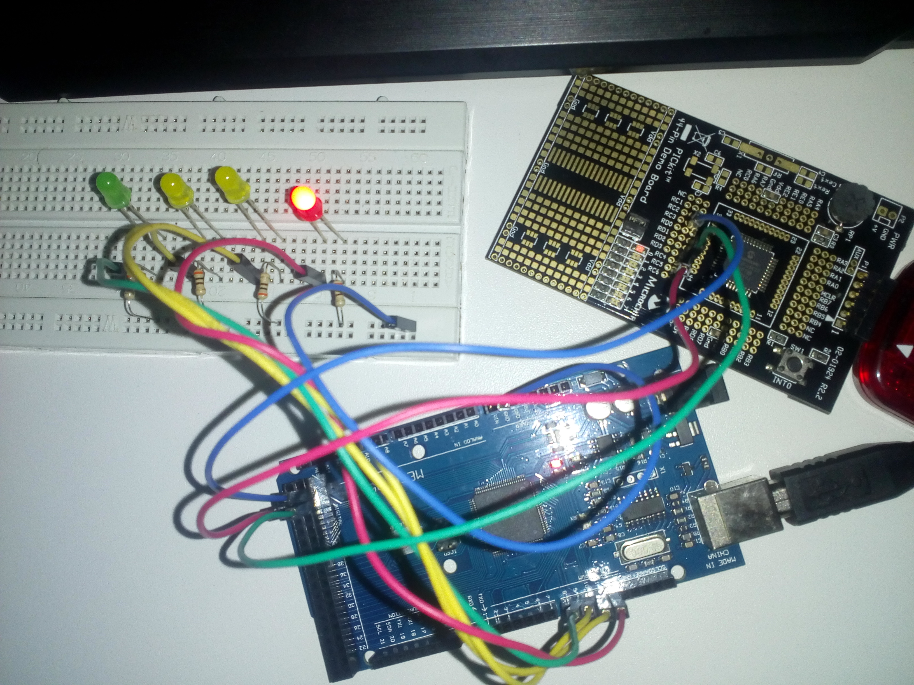

# SEMANA 3

**Microcontroladores:**
- ATmega2560 (Arduino Mega 2560)
- PIC18F45K20

**Objetivos:**
- Programar o Arduino como receptor SPI; e
- Programar o PIC como transmissor(mestre) SPI.

**Descrição:**
O experimento desta semana consistia em desenvolver uma comunicação SPI entre o PIC e o Arduino. Infelizmente, houve falhas nos testes, o receptor(Arduino) ficou recebendo valores que não condizem com o esperado.